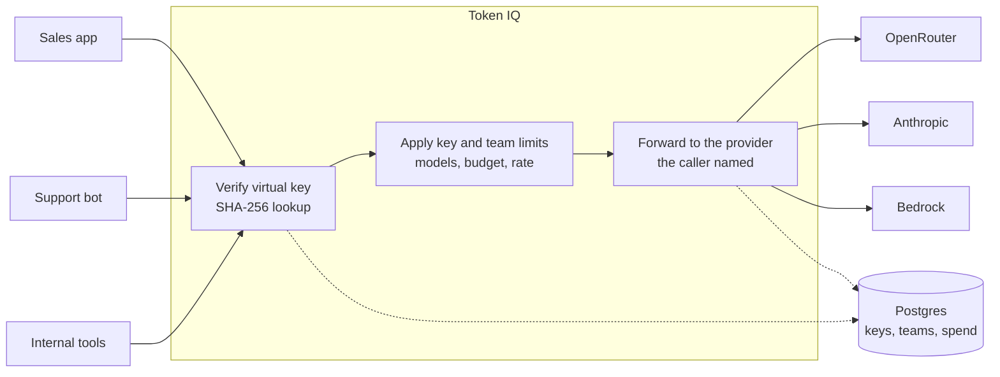
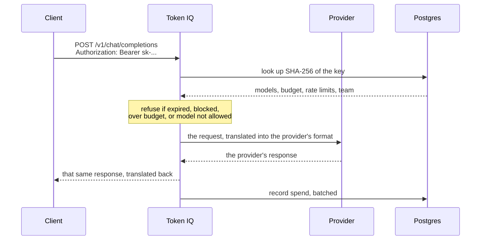

# Token IQ

An observer-only LLM gateway. Token IQ never decides where a request goes or what comes back:
the provider and model are the ones the caller named, the answer is the one that provider
produced, and nothing is served from a cache or retried somewhere else. It watches traffic and
accounts for it.

It offers two ways in, and the difference is worth understanding before you pick one.

On the OpenAI-compatible endpoint, a request is **translated** into the target provider's own
format and the answer is translated back. The content is untouched, but the envelope around it
is not: send an OpenAI-style system message to Anthropic and it arrives in Anthropic's own
`system` field. That translation is the point of a compatible endpoint, it is what lets a
caller switch providers by changing one string.

On the pass-through endpoints, the request body reaches the provider **byte for byte as sent**,
and the provider's reply is returned the same way, errors included. Token IQ still verifies the
key, applies budgets and limits, and records the cost, but it never reads or rewrites the
payload. A caller who wants the stronger guarantee uses these.

Token IQ removes the parts of a general-purpose gateway that alter a request or silently
change where it goes. See [Acknowledgements](#acknowledgements) for the work it builds on.



## What observer-only means here

A gateway that quietly retries against a different provider, falls back to a cheaper model, or
answers from its own cache is convenient and occasionally very confusing: the response a client
receives is not the one their chosen provider produced. Token IQ closes those paths.

- **The provider and model never change.** Retries go back to the same endpoint. Fallback
  configuration is refused at startup rather than ignored, and so are duplicate deployments of
  the same model name, because both let a request end up somewhere the caller did not name.
- **Scored routing is gone.** Latency, cost, usage and complexity strategies were removed, so
  there is no scoring layer left to pick a different deployment.
- **Cooldowns are disabled.** A provider that returned errors is still called if a client asks
  for it, rather than being quietly skipped.
- **Responses are never served from cache.** Cache reads always miss, and both paths that would
  enable caching now refuse.
- **Retries are limited to cases where nothing was processed**: 429, 502, 503, 504, and
  connection failures. A read timeout is not retried, because the provider may already have run
  the request and billed for it.
- **Content is never rewritten, on either endpoint.** The compatible endpoint restructures the
  envelope so one client can address many providers, and says so above. What it will not do is
  edit, summarise, compress or inject anything into what the caller wrote or what the provider
  answered. The pass-through endpoints go further and leave the bytes alone entirely.

Enterprise-gated features are removed rather than shown as upsells.

The path a single request takes:



On a 429, 502, 503, 504 or a connection failure, Token IQ retries the arrow back to the same
provider. There is no second arrow to somewhere else.

## Requirements

- Python 3.10 to 3.14 (this checkout runs 3.12)
- Docker, for the Postgres database
- Node 20 and npm, only if you are changing the dashboard

## Running it

Start the database and the proxy:

```powershell
docker start tokeniq_db
.\run-proxy.ps1
```

`run-proxy.ps1` reads the database credentials from the running container, so no password is
stored in the repo or typed on the command line. The gateway comes up on
<http://localhost:4001> and the dashboard on <http://localhost:4001/ui/>.

If the database container does not exist yet:

```bash
docker compose up -d db
```

### Calling it

A client needs two things: the base URL and a virtual key. The key authenticates the caller and
carries its budget, rate limits and model access. It cannot route anything on its own, which is
why the base URL is shown beside every key in the dashboard.

```bash
curl http://localhost:4001/v1/chat/completions \
  -H "Authorization: Bearer sk-your-key" \
  -H "Content-Type: application/json" \
  -d '{"model": "your-model", "messages": [{"role": "user", "content": "hello"}]}'
```

Any OpenAI-compatible SDK works by pointing `base_url` at the gateway. The proxy serves both
`/chat/completions` and `/v1/chat/completions`, so a base URL with or without `/v1` is fine for
OpenAI-style clients. Anthropic's SDK appends `/v1/messages` itself, so give it the base URL
without `/v1`.

## Configuring it

Models, credentials and settings live in `token_iq/gateway/proxy/dev_config.yaml`, and models added
through the dashboard are stored in Postgres. `general_settings.store_model_in_db` must stay
enabled for the second kind to load at startup.

The **Providers** tab lists only providers the gateway is actually set up for: those carrying
credentials, plus any that have served traffic. A provider whose deployments point at unset
environment variables cannot answer a request, so listing it would describe a gateway that is
not there.

### Keys, teams and budgets

A **virtual key** is stored as a SHA-256 hash, so a lost key is replaced rather than recovered.
Each key carries its own model access, spend cap and rate limits.

A **team** is the unit above it, which usually maps to a department. Teams hold a shared budget
with a reset period, model access, rate limits, members with roles, and a block switch that
stops the whole team at once. Keys belong to teams, and both sets of limits apply, so a team
cap holds no matter how many keys sit inside it.

## Development

```bash
make bootstrap                  # install backend and dashboard dependencies
make check                      # lint, types and the budget gates
```

Backend tests mirror the source tree under `tests/gateway/`:

```bash
pytest tests/gateway/proxy/management_endpoints/
```

The dashboard lives in `ui/litellm-dashboard`. Run `npm run dev` there for a live server on
port 3000, or `npm run build` to produce the static bundle the proxy serves. Run only the test
files your change touches; the full suite is large and CI runs it anyway.

Every deletion and significant change in this fork is recorded in `docs/decisions/`, with the
reasoning and instructions for restoring it.

## Licence

MIT. See [LICENSE](LICENSE), which carries both copyright holders.

## Acknowledgements

Token IQ includes code derived from [LiteLLM](https://github.com/BerriAI/litellm), an
MIT-licensed project by Berri AI, which does the provider translation. That attribution is
recorded in [NOTICE](NOTICE) and in the licence, and it is permanent: the MIT licence
requires the original copyright notice to travel with every copy of this software.

## Repository layout

Where the code is going. Phases 3 to 9 of
[the independent-codebase programme](docs/plans/2026-10-04-independent-codebase.md) move it
there, so today's tree does not match this yet.

```text
token_iq/
  gateway/        the engine: provider translation, proxy, auth, keys, spend tracking
  api/            Token IQ's own API routers
  connectors/     billing/ for providers, tools/ for Claude Code, Copilot, Cursor
  ledger/  attribution/  overview/  seats/  recommendations/
  repositories/   database access for Token IQ's tables
  proxy/          Token IQ's hooks inside the gateway
  types/          data types and API schemas
token_iq_migrations/   Prisma migrations
tests/
  token_iq/       product tests
  gateway/        engine tests
  repo/           repository-wide checks
ui/dashboard/     the admin and product UI
deploy/           images, installations, terraform
docs/             status, product, decisions, specs, plans, runbooks
```

Powered by NITCO Inc.
